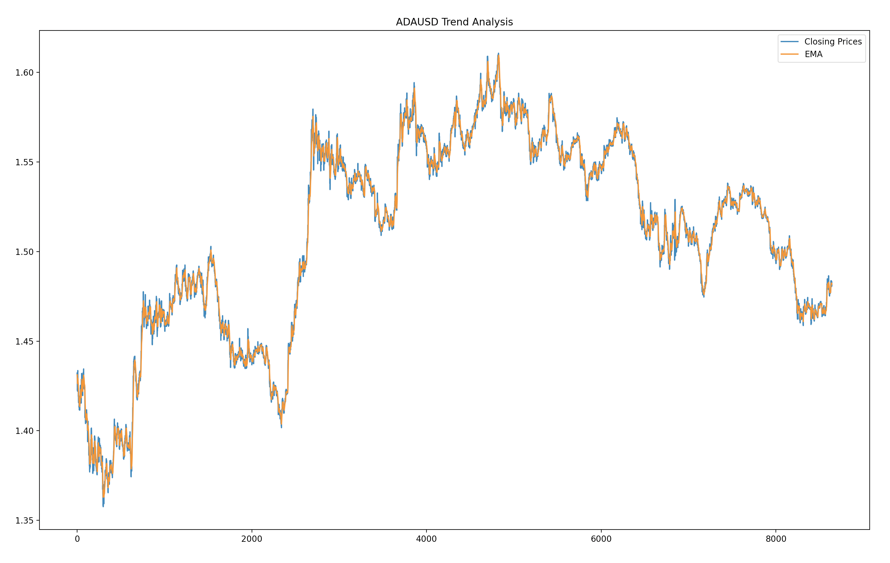
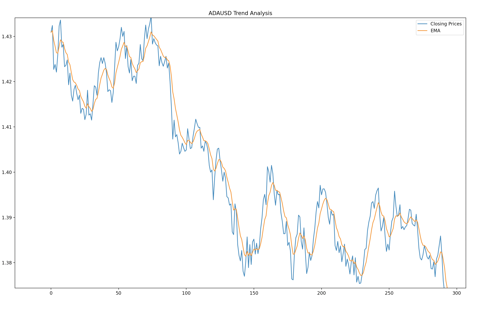

# Crypto Trading Algorithm on Binance.US (Single Person Project)

# Overview
Makes us of Binance's API to gather data and make trades based on historical kline data. The algorithm can perform trend analysis by using exponential moving 
averages to detect upward/downward trends for a the desired cryptocurrency. 

## Development Language
Python

## Technical Anaylsis for Detecting Trends (Full Chart View)

## Zoomed View

